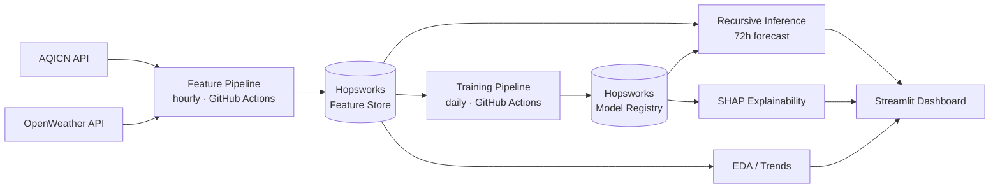

# 🌤️ Pakistan AQI Forecast

**A real-time, 3-day Air Quality Index forecasting pipeline for six Pakistani cities** — built end-to-end on a 100% serverless stack: live ingestion, a Hopsworks Feature Store, four trained models (statistical → deep learning), SHAP explainability, hourly/daily automation via GitHub Actions, and an animated Streamlit dashboard.

> 🎓 Built as a project for the **Shine Internship Program at 10Pearls — Cohort 9**.

**🔴 [Try the live dashboard →](https://aqi-forecast-10pearls.streamlit.app/)**
**💻 [View the source →](https://github.com/SameerTalreja/AQI-Forecast-10pearlsinternship)**

---

## Table of contents

- [What this is](#what-this-is)
- [See it in motion](#see-it-in-motion)
- [Architecture](#architecture)
- [Cities & models](#cities--models)
- [Model results](#model-results)
- [Tech stack](#tech-stack)
- [Repo structure](#repo-structure)
- [Running it yourself](#running-it-yourself)
- [Automation](#automation)
- [Explainability (SHAP)](#explainability-shap)
- [Trends & insights](#trends--insights)
- [Known limitations](#known-limitations--honest-notes)
- [Acknowledgements](#acknowledgements)

---

## What this is

Air quality in Pakistan is genuinely bad — Lahore and Peshawar regularly rank among the world's most polluted cities. This project forecasts AQI **3 days ahead** for six major cities, using a pipeline that runs entirely on free-tier serverless infrastructure:

- **Live data** pulled hourly from AQICN and OpenWeather
- **Feature engineering**: time-based features, lag features (1h/3h/24h), rolling statistics, all computed correctly even with irregular per-city reporting frequency
- **A Hopsworks Feature Store** as the single source of truth for both training and inference
- **Four trained models** — Ridge Regression, Random Forest, XGBoost, and a TensorFlow LSTM — registered and versioned in the Hopsworks Model Registry
- **Recursive 72-hour forecasting**, feeding each hour's prediction back in as input to the next
- **SHAP explainability** for the three classical models, showing plain-language reasons behind each forecast
- **Fully automated** via GitHub Actions: feature pipeline runs hourly, all four models retrain daily — no server, no manual intervention
- **A hand-designed, animated Streamlit dashboard** — not a default Streamlit look

---

## See it in motion

The dashboard isn't just functional — it's designed to feel alive:

- 🌫️ **A living background** — four large, softly blurred color blobs drift and breathe behind the whole page in an endless, staggered loop
- 🎨 **A hero that changes mood with the air** — the header's gradient shifts from clear sky-blue/green (Good) through amber and coral, all the way to deep rose (Hazardous), animating smoothly whenever you switch cities
- 🫧 **Floating pill buttons** — the city and model pickers gently bob up and down, and lift with a soft shadow on hover, instead of sitting static like default form controls
- 💫 **A custom centered loading state** — no default top-right Streamlit spinner; a glass card with a colorful spinning ring appears center-screen while new data loads
- ⚠️ **A gently pulsing hazard alert** — a soft glowing warning card, not a jarring blink, when forecasted AQI crosses the hazardous threshold
- 📊 **Animated "driver" bars** — SHAP explanation bars grow in on load, staggered slightly per row

**Screenshots:**


**Animated demo:**


https://github.com/user-attachments/assets/f58d81f2-1d3f-4f13-9609-c0ef1f5beded


Or just click through the **[live dashboard](https://aqi-forecast-10pearls.streamlit.app/)** yourself — it's the real thing, not a mockup.

---

## Architecture



**Design decisions worth knowing:**
- **Two Hopsworks feature groups**: `aqi_raw` (full audit trail of every fetch, deduped by city+timestamp) and `aqi_features` (engineered, fully recomputed from raw history on every run — guarantees lag/rolling features are always correct rather than incrementally drifting).
- **Time-based train/test splits everywhere** — never random shuffling of time-series data.
- **AQI is derived consistently** across both live and historical data: AQICN's own value for live rows, and the EPA's official PM2.5→AQI breakpoint formula for OpenWeather-derived historical backfill rows (AQICN's free tier doesn't expose deep history).

---

## Cities & models

**Cities** (one global model, `city` as a categorical feature — not six separate models):
Quetta · Lahore · Karachi · Islamabad · Faisalabad · Peshawar

**Models** (statistical → deep learning, as required):
| Model | Type |
|---|---|
| Ridge Regression | Linear baseline |
| Random Forest | Tree ensemble |
| XGBoost | Gradient-boosted trees |
| LSTM (TensorFlow) | Sequence deep learning, city as a side-input |

---

## Model results

Evaluated on a held-out, **time-based** test split (never seen during training), predicting AQI one hour ahead from lag/rolling features:

| Model | RMSE | MAE | R² |
|---|---|---|---|
| Ridge Regression | 1.66 | 0.79 | 0.998 |
| **Random Forest** | **1.03** | **0.48** | **0.999** |
| XGBoost | 1.07 | 0.53 | 0.999 |
| LSTM (TensorFlow) | 4.00 | 2.48 | 0.990 |

**Why LSTM scores lower — and why that's expected, not a bug:** the LSTM only sees a raw scaled AQI sequence (no lag/rolling feature engineering, no weather), and trained on far fewer sequences than the classical models had rows. Tree-based models directly exploit the engineered features; this is a well-documented pattern in the literature — deep learning typically needs substantially more data to overtake feature-engineered classical ML on tabular-style problems. It's a genuine finding, not a training failure (loss curves were smooth and stable across all 30 epochs).

**Important caveat:** these numbers are **single-step (next-hour) accuracy**, not 72-hour-ahead accuracy. The dashboard's actual 3-day forecast is generated *recursively* — each hour's prediction feeds into the next — so error compounds across the horizon. Single-step R²=0.999 does not mean the 72nd hour is equally accurate. See [Known limitations](#known-limitations--honest-notes).

---

## Tech stack

| Layer | Tools |
|---|---|
| Data sources | AQICN API, OpenWeather API (current + historical air pollution) |
| Feature store & model registry | Hopsworks (serverless free tier) |
| ML / modeling | scikit-learn (Ridge, Random Forest), XGBoost, TensorFlow/Keras (LSTM) |
| Explainability | SHAP (TreeExplainer, LinearExplainer) |
| Automation | GitHub Actions (hourly + daily scheduled workflows) |
| Dashboard | Streamlit, Plotly, hand-written CSS (glassmorphism, animation) |
| Language | Python 3.11+ |

---

## Repo structure

```
AQI-Forecast-10pearlsinternship/
├── .github/workflows/
│   ├── feature_pipeline.yml      # hourly
│   └── training_pipeline.yml     # daily
├── app/
│   ├── app.py                    # Streamlit dashboard (entry point)
│   ├── aqi_data.py                # adapter: dashboard ↔ Hopsworks/models
│   └── style.css                  # design system: glass, blobs, animation
├── models/
│   └── .gitkeep                   # trained models live in the Hopsworks
│                                   # Model Registry, not in git — this
│                                   # folder is just a local scratch space
├── src/
│   ├── __init__.py
│   ├── config.py                  # cities, thresholds, constants
│   ├── data_ingestion.py          # AQICN + OpenWeather fetching
│   ├── feature_engineering.py     # time/lag/rolling features
│   ├── feature_pipeline.py        # hourly orchestration → Hopsworks
│   ├── backfill.py                # historical data loader
│   ├── aqi_utils.py               # EPA PM2.5 → AQI conversion
│   ├── training_pipeline.py       # Ridge / Random Forest / XGBoost
│   ├── train_lstm.py              # TensorFlow LSTM
│   ├── inference.py                # recursive 72h forecasting (classical)
│   ├── forecasting.py              # unified dispatcher, all 4 models
│   ├── explainability.py          # SHAP explanations
│   └── eda.py                      # trends, comparisons, data-quality checks
├── debug_aqicn.py                 # one-off diagnostic script used while
│                                   # debugging AQICN station IDs early on
├── requirements.txt
├── .env.example
├── .gitignore
└── README.md
```

> `debug_aqicn.py` was a throwaway script for inspecting raw AQICN API responses during setup — it's not part of the running pipeline. Safe to delete with `git rm debug_aqicn.py` if you'd rather keep the repo strictly production files.

---

## Running it yourself

### 1. Clone the repo
```bash
git clone https://github.com/SameerTalreja/AQI-Forecast-10pearlsinternship.git
cd AQI-Forecast-10pearlsinternship
```

### 2. Set up a virtual environment
```bash
python -m venv .venv
source .venv/bin/activate      # Windows: .venv\Scripts\activate
pip install -r requirements.txt
```

### 3. Get your API keys
| Key | Where to get it |
|---|---|
| `AQICN_API_KEY` | [aqicn.org/data-platform/token](https://aqicn.org/data-platform/token/) — free, instant |
| `OPENWEATHER_API_KEY` | [home.openweathermap.org/users/sign_up](https://home.openweathermap.org/users/sign_up) — free (new keys can take up to a few hours to activate) |
| `HOPSWORKS_API_KEY` | [app.hopsworks.ai](https://app.hopsworks.ai) → Account Settings → API Keys |
| `HOPSWORKS_PROJECT_NAME` | The project name Hopsworks assigns you on signup |

Copy `.env.example` to `.env` and fill these in:
```bash
cp .env.example .env
```

### 4. Backfill historical data (one-time)
```bash
python -m src.backfill --days 30
```

### 5. Train the models
```bash
python -m src.training_pipeline   # Ridge, Random Forest, XGBoost
python -m src.train_lstm          # LSTM
```

### 6. Run the dashboard
```bash
python -m streamlit run app/app.py
```

Or just use the **[hosted version](https://aqi-forecast-10pearls.streamlit.app/)** — no setup required.

---

## Automation

Two scheduled GitHub Actions workflows keep everything current with zero manual intervention:

- **`feature_pipeline.yml`** — runs every hour, fetching fresh readings for all 6 cities and updating the Hopsworks Feature Store
- **`training_pipeline.yml`** — runs daily, retraining all four models against the growing feature history and registering new versions

Both also support manual triggering from the **Actions** tab for on-demand runs.

---

## Explainability (SHAP)

For Random Forest, XGBoost, and Ridge Regression, the dashboard shows a plain-language breakdown of what's driving the current next-hour prediction — e.g. *"AQI three hours ago — Adds about 8"* — rather than a raw SHAP value or an unlabeled chart. Feature names are translated into human-readable labels, and inactive city one-hot columns are filtered out so only meaningful drivers show up.

**LSTM is intentionally not covered** — SHAP support for sequence models (`DeepExplainer`) is significantly slower and more fragile than `TreeExplainer`/`LinearExplainer`, and would need its own background-sequence sampling strategy. Given the project timeline, explaining the three models where SHAP is fast and reliable was the better use of time — a deliberate scope decision, documented rather than hidden.

---

## Trends & insights

A second dashboard tab covers the EDA requirement with live, real data (not a static notebook):
- City-by-city AQI comparison
- Daily trend lines across the full collection period, per city
- Hour-of-day and day-of-week pollution patterns for the selected city
- A **data freshness table** — showing honestly that different cities' stations report at very different frequencies (some near-hourly, others every few days), a real characteristic of the free station network this project relies on

---

## Known limitations — honest notes

Documenting these transparently was a deliberate choice — catching and fixing real problems is more valuable to show than a suspiciously perfect pipeline:

- **Data leakage, caught and fixed**: an early version of the training pipeline included the current PM2.5 reading as a feature — since AQI is directly derived from PM2.5, this let the model trivially reverse-engineer the AQI formula instead of genuinely forecasting, producing an artificially perfect (and useless) RMSE of ~0.13. Fixed by excluding all concurrent pollutant readings from the feature set; a runtime guard now refuses to load any model trained on those columns again.
- **Recursive forecasting compounds error**: the 72-hour forecast is generated by feeding each hour's prediction back in as input to the next. The single-step metrics above (RMSE ~1) do **not** describe 72-hour-ahead accuracy — error naturally grows the further out the forecast goes, and forecasts tend to converge toward a stable value rather than capturing sudden real-world events (like a dust storm).
- **Historical weather is missing**: OpenWeather's historical *weather* API (not air pollution) requires a paid tier. Backfilled rows have no temp/humidity/wind/pressure — only live pipeline rows going forward do. In practice this means weather features get dropped from the model entirely, since they're mostly missing across the full training set.
- **Station reporting is irregular**: some AQICN stations update near-hourly; others (including Quetta and Faisalabad) update every few days. The pipeline detects and flags stale readings rather than silently treating them as fresh, but this does mean lag features for sparser cities are often `NaN` and get backfilled with training medians.
- **Weather features, even when present, are concurrent, not forecasted**: a production version of this system would need actual weather *forecast* data (not historical/current weather) to generate a genuinely forward-looking multi-day forecast without relying purely on AQI's own autocorrelation.

---

## Acknowledgements

Built as a project for the **Shine Internship Program at 10Pearls, Cohort 9**.

Data: [AQICN](https://aqicn.org/) · [OpenWeather](https://openweathermap.org/)
Infrastructure: [Hopsworks](https://www.hopsworks.ai/) · [GitHub Actions](https://github.com/features/actions) · [Streamlit Community Cloud](https://streamlit.io/cloud)
